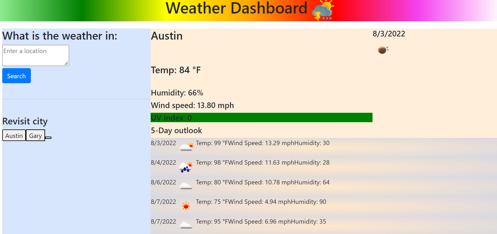

# Weather Dash Board

## Description

This project is for the user that is a frequent traveler or weather enthuses. The purpose for the program is to allow a user to check the weather in a place of their choosing. 

 [Deployed link]()

## Features

I've included the features below using:

- The dashboard obtains weather information from the Open Weather API which allow the program to:
	- Display dates within the program.
	- Obtain various weather conditions such as temperature, humidity, wind speed, etc.
	- Displays the forecasted weather 5 days out 
	- Display icons that corresponds with the weather.

- The dashboard stores all the users recently searched places, and allows them to pull up weather condition for that place with a click of a button.

  

What's to come:

- There will be a carousel that displays weather for random places either before searching a city of to the right of the last forecasting weather element.
- Styling will be applied to all elements of the page to make the user interface look seamless.
- Their will be an addition of feels like temperatures for all weather displaying elements
- Current weather will display the high and low temp for the current day.
-  All forecast temps will be set to the high of the day an not just the temp at a certain time

  

## Images
;
  

## Credits

- JaQwae Ellison